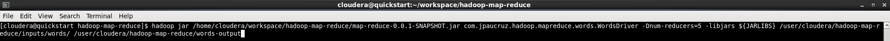
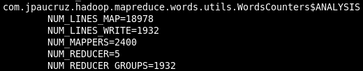
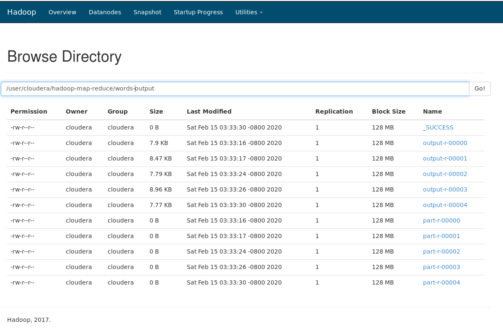
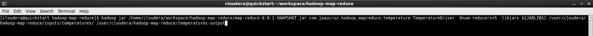
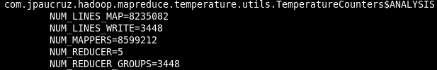
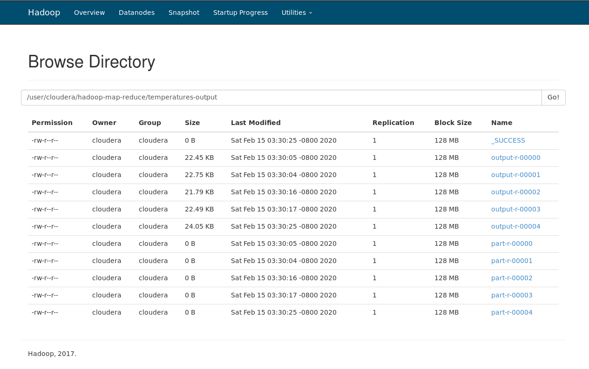
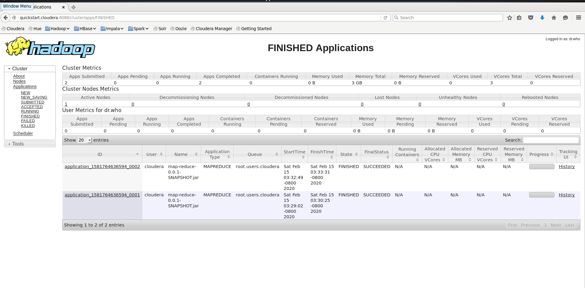

# Hadoop Map-Reduce using Java

Java allows the possibility of creating Map-Reduce processes within the Hadoop environment

##### Requeriments

- Cloudera (Cloudera QuickStart VM: https://www.cloudera.com/downloads/quickstart_vms/5-13.html)
- JDK 7


## The problem

Sometimes, a very large amount of data needs to be processed in an acceptable time and it is here that traditional applications are not able to offer these needs.

##### Problem I

A process that allows counting the occurrences of each of the words in a book is necessary.

##### Problem II

A process is needed to obtain the average temperature of each city for 300 years.

[Example dataset](https://www.kaggle.com/berkeleyearth/climate-change-earth-surface-temperature-data)


## The solution

The parallel and distributed computing is required.

[Hadoop](https://hadoop.apache.org/) is a framework that allows this parallel and distributed processing, among other things. 

The Hadoop [MapReduce](https://hadoop.apache.org/docs/current/hadoop-mapreduce-client/hadoop-mapreduce-client-core/MapReduceTutorial.html) model will be used to process this large amount of data in a reasonable time.

MapReduce processes can be implemented in Java.

##### Hadoop MapReduce dependency

To use these tools, you just have to add the dependency in the _pom.xml_ file.

```xml
<dependency>
    <groupId>org.apache.hadoop</groupId>
    <artifactId>hadoop-client</artifactId>
    <version>2.6.0</version>
</dependency>
```

##### Hadoop MapReduce use

When implementing a Mapreduce process, we can differentiate several parts:

- *Job* : Split the data set into the part that is Map input. Its implementation has all the necessary configuration for the execution of the process, which are the _Mapper_ and _Reducer_ classes that the process will use, ...

```java
public class Driver extends Configured implements Tool{

  // job configuration
  Job job = Job.getInstance(getConf());
  job.setJarByClass(Driver.class);
  job.setMapperClass(Map.class);
  job.setReducerClass(Reduce.class);
  
  ...
  
  // launcher
  job.waitForCompletion(true);
  return 0;

}
```

- *Mapper* : Transforms the entries into key-value pairs. It needs to overwrite the _map_ method offered by the framework with the code that is needed.

```java
public class Map extends Mapper <LongWritable, Text, Text, LongWritable> {
  
  @Override
  public void map(LongWritable key, Text value, Context context){
    ...
  }
  
}
```

- *Partitioner* : The resulting pairs of the previous Mappers are sorted and sent to the Reducers. It is a framework operation and should not be implemented.

- *Reducer* : Performs the appropriate tasks and obtains a valid output. It needs to overwrite the _setup_, _cleanup_ and _reduce_ methods offered by the framework with the code that is needed.

```java
public class Reduce extends Reducer<Text, LongWritable, Text, Text> {

   @Override
    public void setup(Context context) throws IOException, InterruptedException{
      ...
    }
    
    @Override
    public void cleanup(Context context) throws IOException, InterruptedException{
      ...
    }
    
    
    @Override
    public void reduce(Text key, Iterable<LongWritable> values, Context context) throws IOException, InterruptedException{
      ...
    }

}
```

## The case of use

These processes can be launched in two ways: _local_ or _Hadoop cluster_ (cloudera)

The execution of both processes is performed in the Hadoop cluster (cloudera), as it is the most common infrastructure for process performance and distributed computing.

In this project two use cases have been proposed corresponding to the two problems defined.

##### Case of use I - words counter

- [Job/Driver](src/main/java/com/jpaucruz/hadoop/mapreduce/words/WordsDriver.java) Main class
- [Mapper](src/main/java/com/jpaucruz/hadoop/mapreduce/words/WordsMap.java)
- [Reducer](src/main/java/com/jpaucruz/hadoop/mapreduce/words/WordsReduce.java)

###### Process execution command


###### Process Execution output


###### Process output HDFS

[output-example](src/main/resources/output-example-words)


##### Case of use II - average temperature

- [Job/Driver](src/main/java/com/jpaucruz/hadoop/mapreduce/temperature/TemperatureDriver.java) Main class
- [Mapper](src/main/java/com/jpaucruz/hadoop/mapreduce/temperature/TemperatureMap.java)
- [Reducer](src/main/java/com/jpaucruz/hadoop/mapreduce/temperature/TemperatureReduce.java)

###### Process execution command


###### Process Execution output


###### Process output HDFS

[output-example](src/main/resources/output-example-temperature)


Finally, the Hadoop cluster with the two executions
